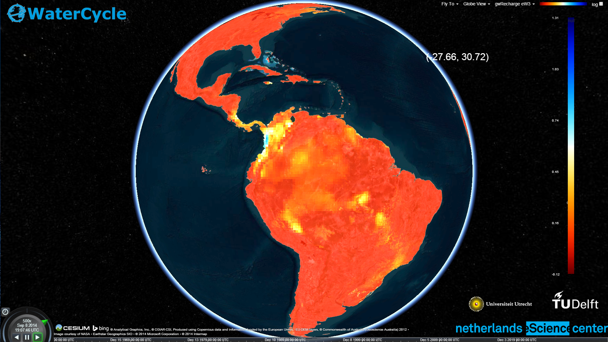

eWaterCycle-Demo
================

Cesium (cesiumjs.org) based demo for eWaterCycle project.

Getting started (windows, from scratch)
---------------------------------------
1. Install Git : 	http://git-scm.com/downloads
2. Install Node.js : 	http://nodejs.org/
3. Start Git bash
4. Type: "npm install bower connect serve-static"
5. Close Git bash
6. Add C:\Users\{YOUR USERNAME HERE}\node_modules\bower\bin to your PATH
7. Start Git bash
8. Type: "git clone https://github.com/NLeSC/eWaterCycle-Demo.git"
9. Type: "cd PattyVis"
10. Type: "bower install"
11. Install Apache Tomcat (http://tomcat.apache.org/)
12. Download and install ncWMS (http://www.resc.rdg.ac.uk/trac/ncWMS/)
13. Serve some netcdf data with ncWMS via the admin interface.
14. Open browser, go to "http://localhost:8080/eWaterCycle-Demo/app/bootstrap.html"

Getting started (Linux, Debian and Ubuntu based)
-------------------------------------------------
1. Install git: "sudo apt-get install git".
2. Install nodejs, Follow instructions at joyents github website: (https://github.com/joyent/node/wiki/Installing-Node.js-via-package-manager#debian-and-ubuntu-based-linux-distributions).
3. Install nodejs module bower globally: "sudo npm install -g bower".
4. Fetch git repository: "git clone https://github.com/NLeSC/eWaterCycle-Demo".
5. Setup with bower: "cd eWaterCycle-Demo ; bower install".
6. Serve with your favourite webserver solution, we recommend Apache Tomcat, you can find it here: (http://tomcat.apache.org/).
7. Download and install ncWMS, find it here: (http://www.resc.rdg.ac.uk/trac/ncWMS/).
8. Configure ncWMS, make sure to serve at least some netcdf data with your ncWMS setup.
9. Access eWaterCycle-Demo with web browser, running app should be available at url: (http://localhost:8000/).

Copyrights & Disclaimers
------------------------

eWaterCycle-Demo is copyrighted by the Netherlands eScience Center and 
releases under the Apache License, Version 2.0.

See <http://www.esciencecenter.nl> for more information on the 
Netherlands eScience Center.

See the "LICENSE" file for more information. 
